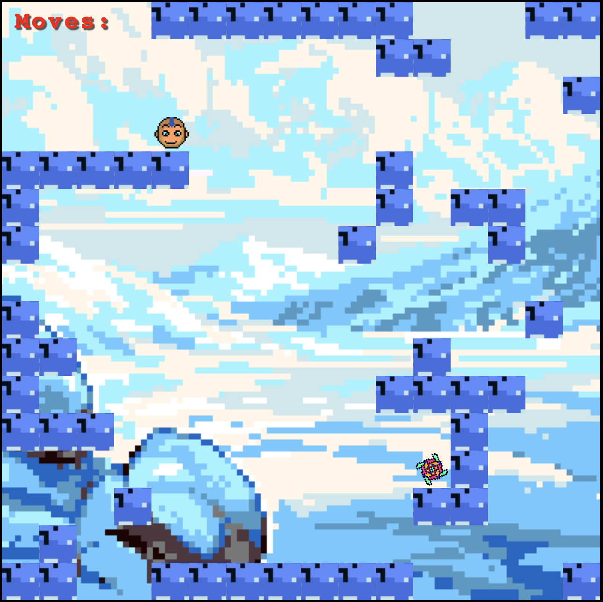

# A novel, abstract, single-player puzzle game

## Table of contents

- [Overview](#overview)
  - [The goal](#the-goal)
  - [Screenshot](#screenshot)
- [My process](#my-process)
  - [Built with](#built-with)
  - [What I learned](#what-i-learned)
  - [Continued development](#continued-development)
  - [Useful resources](#useful-resources)
- [Author](#author)
- [Acknowledgments](#acknowledgments)

## Overview

### The goal

Users should be able to:

- [x] Guide Aang to the spinning vortex using arrow keys up, down, left, and right

### Screenshot

## My process

- I made the level layout using Google Sheets

### Built with

- Semantic HTML5 markup
- CSS
- Flexbox
- ES6 JavaScript

### What I learned

- WCAG 2.0 level AA requires a contrast ratio of at least 4.5:1 for normal text and 3:1 for large text. WCAG 2.1 requires a contrast ratio of at least 3:1 for graphics and user interface components (such as form input borders). WCAG Level AAA requires a contrast ratio of at least 7:1 for normal text and 4.5:1 for large text. Large text is defined as 14 point (typically 18.66px) and bold or larger, or 18 point (typically 24px) or larger.

### Continued development

I want to add more levels with increasing complexity.

### Useful resources

- [Pixel Art Maker](http://pixelartmaker.com/) - I made my pixel art using Pixel Art Maker.
- [Mixkit](https://mixkit.co/) - The library used for all sound effects and game music.

## Author

- Website - [Coming soon!](#)
- GitHub - [@FredrikRidderfalk](https://github.com/FredrikRidderfalk)
- Twitter - [@Ridderfalk](https://twitter.com/Ridderfalk)

## Acknowledgments

Thank you habibi for your valuable feedback!
